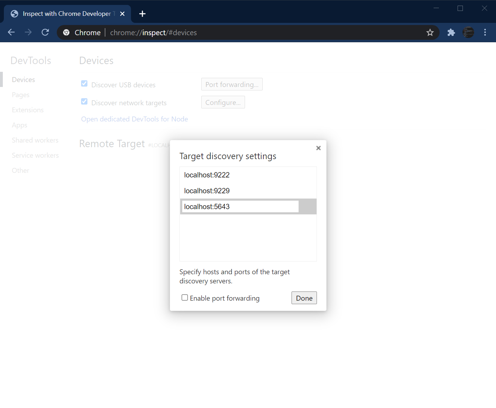
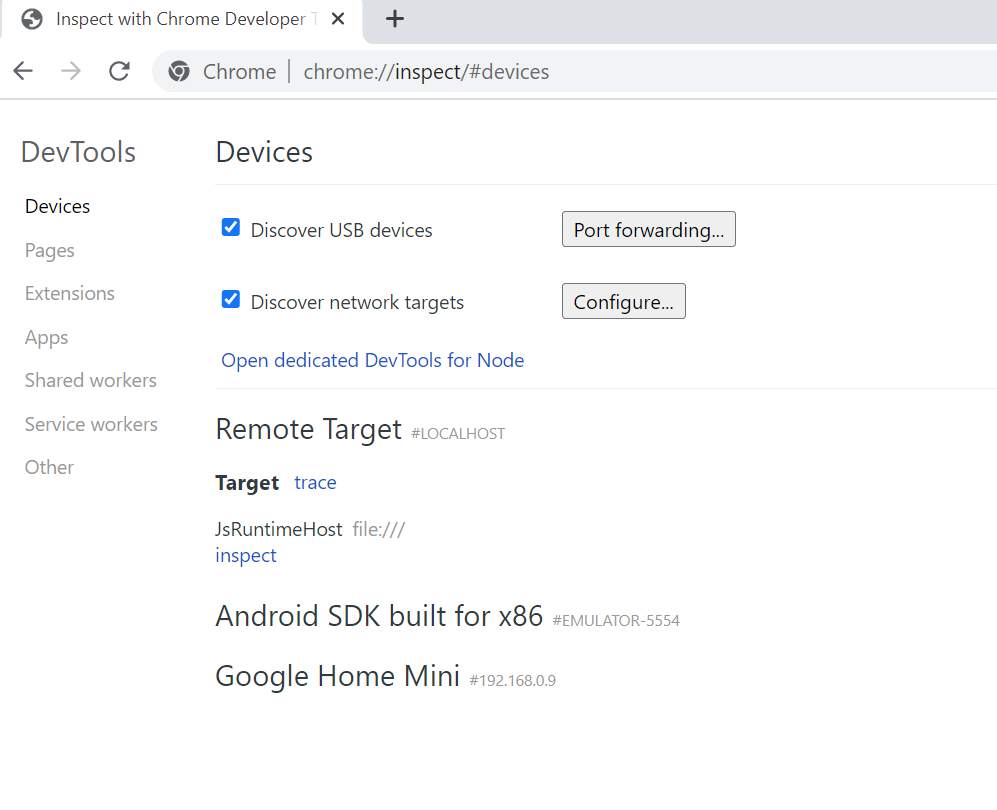
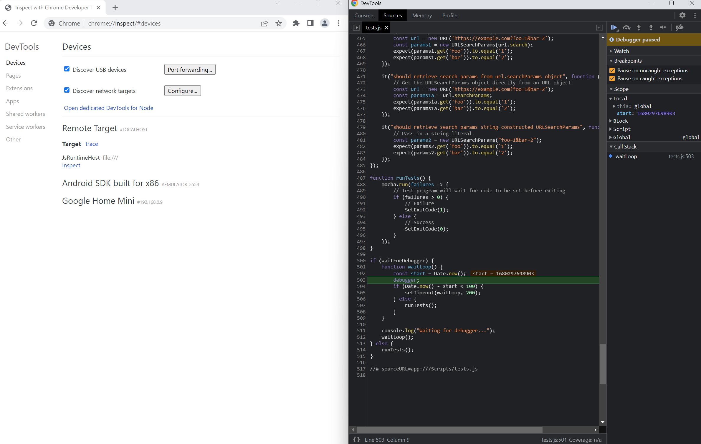
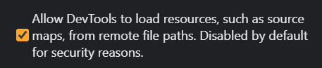

# JsRuntimeHost Script Debugging
You can use Chromium DevTools to debug your JavaScript while running with the V8 JavaScript engine (Default Engine for Android).

## Add the Remote Target URL
Depending on which Chromium-based browser you're using (Edge or Chrome), navigate to `edge://inspect` or `chrome://inspect`.
Click `Configure...` and in the target discovery settings add an entry `localhost:{port}`, where `{port}` is consistent with the one supplied to the call in [AppRuntime_V8.cpp](https://github.com/BabylonJS/JsRuntimeHost/blob/f487c7b3f89b407e95a53543a06a34f1a1fbb860/Core/AppRuntime/Source/AppRuntime_V8.cpp#L85) and [AppRuntime_JSI.cpp](https://github.com/BabylonJS/JsRuntimeHost/blob/09c5acc49a6a64dec0e62075aebac6ad0a32aa93/Core/AppRuntime/Source/AppRuntime_JSI.cpp#L39).



## Setting Up To Debug
Make sure to change the line in [tests.js](https://github.com/BabylonJS/JsRuntimeHost/blob/f487c7b3f89b407e95a53543a06a34f1a1fbb860/Tests/UnitTests/Scripts/tests.js#L2) to true, or else the DevTools won't have enough time to attach to the Javascript Instance. If you are debugging your own script, you can also use [setTimeout()](https://developer.mozilla.org/en-US/docs/web/api/settimeout) to delay the execution of the code you are trying to debug while you wait to attach the debugger.

## Click Inspect
Run the UnitTests application and wait for the DevTools page to recognize the inspector server spun up by the app. Once you see the app pop up in the list of Remote Targets, you may click inspect to open up a DevTools window.



## View Logs, Set Breakpoints, Profile, and More
Once you have the DevTools window open, you can use it in the same way as if you were inspecting a web page.
For more information, see this documentation from Google on [how to debug JavaScript using Chrome DevTools](https://developer.chrome.com/docs/devtools/javascript/).



## DevTool Settings

If you have issues loading some of your Javascript files double check that this setting is enabled. Go into the settings by clicking on the gear in the top right corner and check this box in the preferences tab.



## Debugging on Android

Download and unzip [ADB](https://developer.android.com/tools/releases/platform-tools) and run the following commands in that folder while your android device is plugged in (or emulator is on in Android Studio)
```
adb forward tcp:5643 tcp:5643
adb reverse tcp:8000 tcp:8000
```

Note, every time you unplug and re-plug your device these ADB commands need to be run again.
