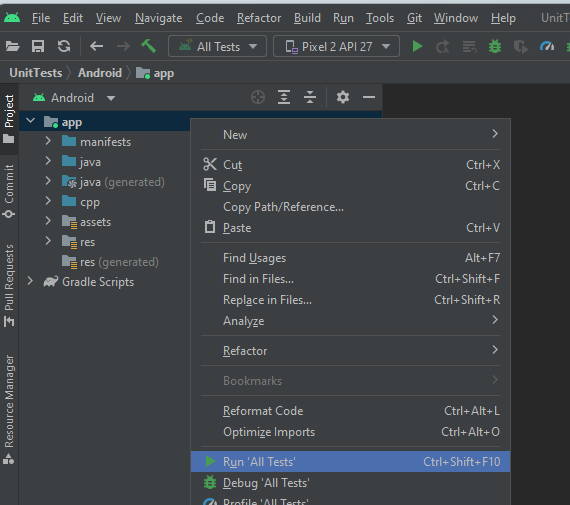

[](https://dev.azure.com/babylonjs/ContinousIntegration/_build/latest?definitionId=22&branchName=main)

# JavaScript Runtime Host
The JsRuntimeHost is a library that provides cross-platform C++ JavaScript hosting for
any JavaScript engines with Node-API support such as Chakra, V8, or JavaScriptCore. The
Node-API contract from Node.js allows consumers of this library to interact with the
JavaScript engine with a consistent interface. This library also provides some optional
polyfills that consumers can include if required.


## **Building - All Development Platforms**

**Required Tools:** [git](https://git-scm.com/), [CMake](https://cmake.org/), [node.js](https://nodejs.org/en/)

The first step for all development environments and targets is to clone this repository. 

Use a git-enabled terminal to run the following command.

```
git clone https://github.com/BabylonJS/JsRuntimeHost.git
```

The unit tests require some NPM packages. From the root of the repository on the command line, run the following commands:

```
cd Tests
npm install
```

## **Building on Windows, Targeting Android**

_Follow the steps from [All Development Platforms](#all-development-platforms) before proceeding._

**Required Tools:**
[Android Studio](https://developer.android.com/studio), [Node.js](https://nodejs.org/en/download/), [Ninja](https://ninja-build.org/)

The minimal requirement target is Android 5.0.

Only building with Android Studio is supported. CMake is not used directly. Instead, Gradle
is used for building and CMake is automatically invocated for building the native part.
An `.apk` that can be executed on your device or simulator is the output.

First, download the latest release of Ninja, extract the binary, and add it to your system path.

Once you have Android Studio downloaded, you need to set up an Android emulator if you do not have a physical Android device. You can do this by selecting `Tools` -> `Device Manager` and then selecting a device. (We are using Pixel 2 API 27). 

Open the project located at
`JsRuntimeHost\Tests\UnitTests\Android` with Android Studio. Note that this can take a while to load. (The bottom right corner of the Android Studio window shows you what is currently being loaded.) 

Then in the LEFT PANE, right click on `app`, and select `Run 'All Tests'`, as displayed in the image below.



If you don't have an Android device plugged in or no Android image in the Android emulator, that option will be greyed and inaccessible. 

**Troubleshooting:**
If the `app\cpp` folder on the left navigation pane is empty, select `File` -> `Sync Project with Gradle Files` and try to re-run the project by selecting `Run` -> `Run 'All Tests'`.

## Contributing

Please read [CONTRIBUTING.md](./CONTRIBUTING.md) for details on our code of conduct, and 
the process for submitting pull requests.

## Reporting Security Issues

Security issues and bugs should be reported privately, via email, to the Microsoft 
Security Response Center (MSRC) at [secure@microsoft.com](mailto:secure@microsoft.com). 
You should receive a response within 24 hours. If for some reason you do not, please 
follow up via email to ensure we received your original message. Further information, 
including the [MSRC PGP](https://technet.microsoft.com/en-us/security/dn606155) key, can 
be found in the [Security TechCenter](https://technet.microsoft.com/en-us/security/default).
