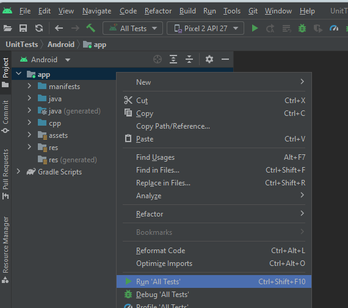

[](https://github.com/BabylonJS/JsRuntimeHost/actions/workflows/ci.yml)

# JavaScript Runtime Host
The JsRuntimeHost is a library that provides cross-platform C++ JavaScript hosting for
any JavaScript engines with Node-API support such as Chakra, V8, or JavaScriptCore. The
Node-API contract from Node.js allows consumers of this library to interact with the
JavaScript engine with a consistent interface. This library also provides some optional
polyfills that consumers can include if required.

> **Hermes support is experimental.** The Hermes (`static_h`) engine integration is
> available on Windows, Android, and Linux for evaluation purposes only. **Hermes is
> not supported on Apple platforms (iOS or macOS)** — configuring the build with
> `NAPI_JAVASCRIPT_ENGINE=Hermes` on those targets will fail with a CMake error.

## Dynamic JavaScript loading

The optional `DynamicScriptLoader` polyfill installs `loadScript(name)`, which
returns a promise that settles after evaluating source in the current JavaScript
context. The host supplies a resolver that returns either a JavaScript string or
a promise of a string, so resources may be available immediately or retrieved
asynchronously. Missing resources (null or undefined), rejected lookups, and
evaluation errors reject the returned promise. The resolver runs on the
JavaScript thread; if an asynchronous host operation finishes on another thread,
dispatch back to the JavaScript thread before resolving its promise. No file or
network loader is installed by JsRuntimeHost.

```cpp
#include <Babylon/Polyfills/DynamicScriptLoader.h>

Babylon::Polyfills::DynamicScriptLoader::Initialize(env,
    [](Napi::Env env, const std::string& name) -> Napi::Value {
        auto source = FindPackagedScript(name);
        return source ? Napi::String::New(env, *source) : env.Null();
    });
```

For hosts with synchronous packaged resources, the optional `ImportScripts`
polyfill provides a worker-style `importScripts(...names)` loader. Install it before
evaluating the entry script, and return source only for exact packaged names:

```cpp
#include <Babylon/Polyfills/ImportScripts.h>

Babylon::Polyfills::ImportScripts::Initialize(env,
    [](const std::string& name) -> std::optional<std::string> {
        return FindEmbeddedChunk(name); // nullopt for names not packaged by the host
    });
```

This loader also exposes `self` if absent. It accepts string resource names
and evaluates them synchronously in order; missing chunks and evaluation
failures throw JavaScript errors. Both resolvers
control which names are accepted; neither polyfill adds a file or network
fallback. The `JSRUNTIMEHOST_POLYFILL_DYNAMIC_SCRIPT_LOADER` and
`JSRUNTIMEHOST_POLYFILL_IMPORT_SCRIPTS` options control the respective libraries.

For source-level `import("./chunk")`, configure the native Webpack build with
`output.chunkLoading: "import-scripts"` and `output.chunkFormat: "array-push"`,
then package its emitted chunks for the resolver. Webpack still returns a promise
from `import()`; its native loader calls `importScripts` to install a chunk before
resolving that promise. Hosts with only asynchronous resource access instead need
a bundler chunk loader that awaits `loadScript(name)`; Webpack's built-in
`import-scripts` loader cannot await it. A browser build can use its normal
asynchronous URL-based chunk loader. Neither polyfill adds native ES module parsing
to engines such as Chakra.


## **Building - All Development Platforms**

**Required Tools:** [git](https://git-scm.com/), [CMake](https://cmake.org/), [node.js](https://nodejs.org/en/)

The first step for all development environments and targets is to clone this repository. 

Use a git-enabled terminal to run the following command.

```
git clone https://github.com/BabylonJS/JsRuntimeHost.git
```

The unit tests require some NPM packages. From the root of the repository on the command line, run the following commands. The CMake or Android Gradle build generates `tests.js` in its build directory and packages it as `Assets/tests.js`; installing packages alone does not build the bundle.

```
cd Tests
npm install
```

## **Building on Windows, Targeting Android**

_Follow the steps from [All Development Platforms](#all-development-platforms) before proceeding._

**Required Tools:**
[Android Studio](https://developer.android.com/studio), [Node.js](https://nodejs.org/en/download/), [Ninja](https://ninja-build.org/)

The minimal requirement target is Android 5.0.

Only building with Android Studio is supported. CMake is not used directly. Instead, Gradle
is used for building and CMake is automatically invocated for building the native part.
An `.apk` that can be executed on your device or simulator is the output.

First, download the latest release of Ninja, extract the binary, and add it to your system path.

Once you have Android Studio downloaded, you need to set up an Android emulator if you do not have a physical Android device. You can do this by selecting `Tools` -> `Device Manager` and then selecting a device. (We are using Pixel 2 API 27). 

Open the project located at
`JsRuntimeHost\Tests\UnitTests\Source\Android` with Android Studio. Note that this can take a while to load. (The bottom right corner of the Android Studio window shows you what is currently being loaded.)

Then in the LEFT PANE, right click on `app`, and select `Run 'All Tests'`, as displayed in the image below.



If you don't have an Android device plugged in or no Android image in the Android emulator, that option will be greyed and inaccessible. 

**Troubleshooting:**
If the `app\cpp` folder on the left navigation pane is empty, select `File` -> `Sync Project with Gradle Files` and try to re-run the project by selecting `Run` -> `Run 'All Tests'`.

## Contributing

Please read [CONTRIBUTING.md](./CONTRIBUTING.md) for details on our code of conduct, and 
the process for submitting pull requests.

## Reporting Security Issues

Security issues and bugs should be reported privately, via email, to the Microsoft 
Security Response Center (MSRC) at [secure@microsoft.com](mailto:secure@microsoft.com). 
You should receive a response within 24 hours. If for some reason you do not, please 
follow up via email to ensure we received your original message. Further information, 
including the [MSRC PGP](https://technet.microsoft.com/en-us/security/dn606155) key, can 
be found in the [Security TechCenter](https://technet.microsoft.com/en-us/security/default).